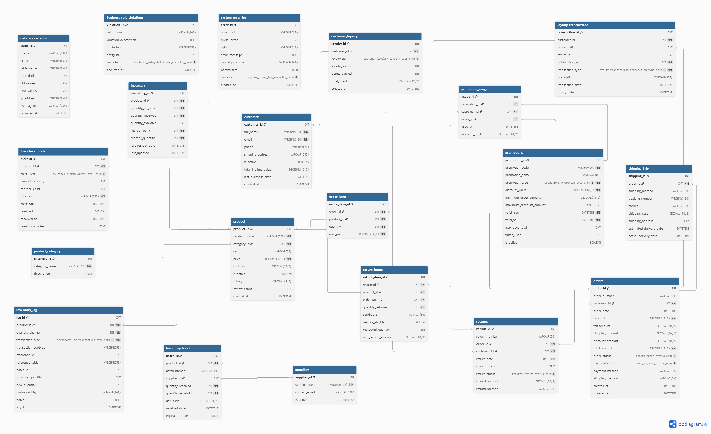

# IOMS - Inventory and Order Management System (Capstone)

**Status:** Production Ready (v2.0)  
**Author:** KWISANGA Ernest
**Database:** MySQL 8.0+

## Table of Contents
1.  [Overview](#overview)
2.  [Project Structure](#project-structure)
    *   [Database Schema (ERD)](#database-schema-erd)
3.  [Setup Instructions](#setup-instructions)
4.  [Key Features & Optimization](#key-features--optimization)

## Overview
This Capstone project implements a scalable, High-Performance **Inventory and Order Management System (IOMS)**. 
Unlike basic implementations, this version features a **3NF Enhanced Schema** supporting advanced e-commerce capabilities including:
-   **Dynamic Inventory Management** (Real-time tracking, Locking, Reservations)
-   **Complex Order Processing** (ACID Transactions, Multi-item support)
-   **Promotions Engine** (Percentage, Fixed Amount, Free Shipping)
-   **Loyalty System** (Points accrual and redemption)
-   **Audit Logging** (Full traceability of stock movements)

For a detailed explanation of tables, variables, and relationships, see the **[Database Schema Documentation](docs/schema_documentation.md)**.


## Project Structure
The project is organized efficiently for development (`src`) and deployment (`dist`).

```ascii
DEM03/
├── dist/                    # FINAL DELIVERABLES (Run these)
│   ├── ioms_ddl.sql         # Creates Database, Tables, Views & Constraints
│   └── ioms_dml.sql         # Inserts Seed Data, Procedures, Triggers & KPIs
├── src/                     # Source Code (Modular)
│   ├── ddl/                 # Schema Definitions
│   ├── dml/                 # Data & Logic (Seeds, Procedures, Triggers)
│   └── queries/             # Analytical Queries
└── verify_project.sql       # Test Script
```

### Database Schema (ERD)

[More information](docs\schema_documentation.md)

## Setup Instructions

### 1. Initialize Database
Run the [DDL script](dist/ioms_ddl.sql) to create the schema and structure.
```bash
mysql -u root -p < dist/ioms_ddl.sql
```

### 2. Load Data & Logic
Run the [DML script](dist/ioms_dml.sql) to populate seed data and install stored procedures.
```bash
mysql -u root -p < dist/ioms_dml.sql
```

### 3. Verify Installation
Run the [verification script](verify_project.sql) to test order placement and inventory logic.
```bash
mysql -u root -p < verify_project.sql
```

## Key Features & Optimization

### 1. Advanced Stored Procedure: `PlaceOrder`
-   **Transaction Safety**: Uses `START TRANSACTION` and `COMMIT/ROLLBACK` to ensure data consistency.
-   **Concurrency Control**: Uses `FOR UPDATE` to lock inventory rows, preventing race conditions (overselling).
-   **Validation**: Checks stock levels, account status, and promo code validity before processing.

### 2. Performance Optimization
-   **Indexes**: Added on high-traffic columns (`customer_id`, `order_date`, `product_category`).
-   **Views**: `CustomerSalesSummary` pre-aggregates data for faster reporting.
-   **Triggers**: `trg_low_stock_alert` automatically monitors inventory health.
